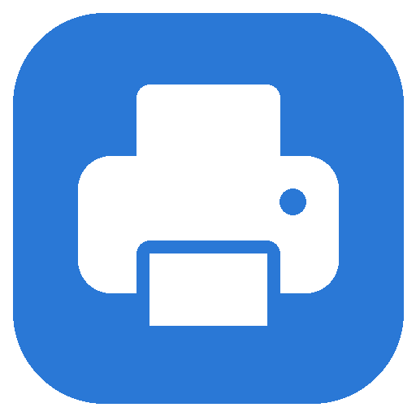

<p align="center">
  
</p>

<h1 align="center">PrintDeck</h1>

<p align="center">
  Fila de impressão 3D compartilhada.<br>
  Os amigos mandam o G-code por um link; você controla a fila, os custos e a impressora.
</p>

<p align="center">
  <a href="https://github.com/renatoacj/printdeck/releases/latest"></a>
  
  
  <a href="LICENSE"></a>
</p>

---

## Recursos

- **Fila com previsão**: cada pedido mostra tempo, filamento, custo e o horário em que começa e termina.
- **Custos transparentes**: material (preço por kg) + energia (potência × tempo × tarifa), por impressão e por pessoa.
- **Dashboard**: quem mais usou a impressora, quanto cada um gastou, falhas e o que está imprimindo agora.
- **Rolos de filamento**: cada impressão fica marcada com o código do rolo. O programa desconta o que saiu de verdade e avisa quando o rolo não vai dar para a fila.
- **OctoPrint**: imprimir com um clique, progresso e temperaturas ao vivo, pausar, retomar e cancelar, e o modelo 3D sendo construído na tela. A impressão **nunca começa sozinha**: só quando o dono clica.
- **Mesa conjunta**: junta vários G-codes do Cura em uma impressão só, encaixando as peças na mesa de 220 × 220 mm e dividindo o custo por peça.
- **Reimprimir com um clique** a partir do histórico.
- **Aplicativo de desktop**: janela própria e ícone na bandeja, sem terminal aberto.
- **Aplicativo para Android** (`.apk`) para gerenciar as impressões pelo celular; no iPhone, instalável direto do navegador.
- **Link para os amigos**: fixo e gratuito com o Tailscale Funnel, ou automático com um [Cloudflare Quick Tunnel](https://try.cloudflare.com). Eles não instalam nada.
- **Seguro por padrão**: senhas com hash, limite de tentativas, e a senha de fábrica nunca é aceita pelo link público.

## Instalar

**[⬇ Baixar o instalador (última versão)](https://github.com/renatoacj/printdeck/releases/latest)**

Baixe o `PrintDeck-x.y.z.zip`, extraia numa pasta definitiva (ex.: `C:\PrintDeck`) e dê dois cliques em **`instalar.bat`**. Ele instala o Python se faltar, prepara tudo em 1 a 3 minutos, cria o atalho **PrintDeck** na Área de Trabalho e abre o programa.

- **Requisitos:** Windows 10 ou 11, 64 bits. Feito para a Creality Ender 3 / Ender 3 Pro com G-code do Cura; o OctoPrint é opcional.
- **Aviso do Windows:** como o instalador veio da internet e não tem assinatura digital, o Windows pode mostrar "O Windows protegeu o computador". Clique em **Mais informações → Executar assim mesmo**.
- **Não mova a pasta** depois de instalar: o atalho aponta para ela.

## Como usar

1. Abra o **PrintDeck** e entre em **Administrativo** (senha inicial `admin`).
2. Em **Configurações**, troque a senha do administrador, defina a **senha da galera** (a que você passa para os amigos), ajuste a tarifa de energia e cadastre o rolo de filamento.
3. No cartão **Link para os amigos**, clique em **Ligar acesso pela internet** e mande o link no grupo.
4. Cada amigo fatia no Cura (**"Salvar no disco"**), abre o link, digita o nome e envia um ou mais `.gcode`.
5. Confira a mesa e clique em **Imprimir** (com OctoPrint), ou baixe o G-code para o microSD e marque **Imprimindo** / **Concluída** / **Falhou** à mão.

> Dica: para ver a miniatura da peça na fila, ative no Cura *Extensões → Pós-processamento → Modificar G-code → "Create Thumbnail"*.

### Link fixo para os amigos

| | Link | O que precisa |
|---|---|---|
| **Tailscale Funnel** | Fixo: `https://nome-do-pc.sua-rede.ts.net` | [Tailscale](https://tailscale.com/download) instalado e logado no computador, com o Funnel liberado (rode `tailscale funnel 5000` uma vez e aprove no endereço que ele mostrar) |
| **Cloudflare Quick Tunnel** | Muda quando o túnel reinicia | Só o `cloudflared` (`winget install Cloudflare.cloudflared`); sem conta |

Se o Tailscale estiver pronto, o PrintDeck usa o link fixo; senão, usa o túnel do Cloudflare. Na mesma rede Wi-Fi também funciona `http://IP-DO-PC:5000`.

### Aplicativo no celular

**Android:** baixe o `PrintDeck-x.y.z.apk` na página de [Releases](https://github.com/renatoacj/printdeck/releases/latest) e abra o arquivo no celular. O Android vai pedir para permitir a instalação de apps dessa origem (navegador ou gerenciador de arquivos): permita e instale. Na primeira vez o app pede o **endereço do PrintDeck**:

- os amigos colam o link que o dono mandou;
- o dono cola o **link fixo do administrador** (cartão "Link para os amigos") e já entra no Administrativo.

Para trocar o endereço depois, segure o dedo no ícone do app → **Trocar endereço**. Requer Android 8 ou mais novo.

**iPhone (ou sem instalar o .apk):** abra o link no Safari → Compartilhar → **Adicionar à Tela de Início**. No Chrome do Android: **⋮ → Instalar app**.

### OctoPrint

Em **Administrativo → Configurações → Impressora (OctoPrint)**, informe o endereço (ex.: `http://octopi.local`) e a chave de API (no OctoPrint: Configurações → *Application Keys*). A partir daí cada pedido ganha o botão **Imprimir**, e o progresso, o tempo real e o filamento gasto são registrados sozinhos. Uma impressão cancelada vira **Falhou em X%** e só o filamento usado até ali entra na conta.

## Rodar pelo código

Requisitos: [Python 3.10+](https://www.python.org/downloads/).

```bash
python -m venv .venv
.venv\Scripts\pip install -r requirements.txt
.venv\Scripts\python desktop.py
```

`python app.py` (ou `iniciar.bat`) sobe só o servidor e abre no navegador, sem janela própria nem bandeja. No Linux / Raspberry Pi: `./iniciar.sh`.

Para criar os atalhos da Área de Trabalho e do menu Iniciar: `.venv\Scripts\python desktop.py --atalho`.

Para gerar o `.apk` (requer um JDK 17 e o Android SDK com `platforms;android-34` e `build-tools;34.0.0`; não usa Gradle nem Android Studio):

```bash
powershell -ExecutionPolicy Bypass -File android\build.ps1 -Versao 1.1.0 -Codigo 2
```

Na primeira vez o script cria a chave de assinatura em `~\PrintDeck\android\`. Guarde esse arquivo e o `.senha` ao lado: sem eles, uma versão nova não instala por cima da antiga.

## Como funciona

```
┌────────────────────── PrintDeck (computador do dono) ──────────────────────┐
│  Flask (porta 5000): fila, custos, dashboard e administrativo              │
│  SQLite (fila.db) + pasta com os G-codes enviados                          │
│  Janela própria (WebView2) + ícone na bandeja                              │
└───────────┬─────────────────────────────────────────┬──────────────────────┘
            │ API do OctoPrint (rede de casa)         │ Tailscale Funnel ou cloudflared
            ▼                                         ▼
  Raspberry Pi + OctoPrint → impressora      https://…  →  navegador ou app dos amigos
```

| Arquivo | Função |
|---|---|
| [`app.py`](app.py) | Servidor: fila, custos, rolos, dashboard, administrativo e sincronização com o OctoPrint |
| [`desktop.py`](desktop.py) | Aplicativo de desktop: janela, bandeja e atalhos |
| [`gcode_parser.py`](gcode_parser.py) | Lê tempo, filamento e miniatura do G-code; calcula o filamento que saiu até cada ponto do arquivo |
| [`juntar.py`](juntar.py) | Mesa conjunta: encaixa as peças na mesa e costura os G-codes camada por camada |
| [`octoprint.py`](octoprint.py) | Cliente da API do OctoPrint |
| [`tunel.py`](tunel.py) | Link público: Tailscale Funnel ou `cloudflared` |
| [`templates/`](templates) | Páginas (fila, dashboard, administrativo) |
| [`static/visualizador.js`](static/visualizador.js) | Modelo 3D da peça sendo impressa (three.js) |
| [`static/app/`](static/app) | Aplicativo instalável no celular (manifesto, ícones e service worker) |
| [`instalar.bat`](instalar.bat) | Instalador para Windows |
| [`android/`](android) | Aplicativo para Android (uma tela que abre o painel) e o script que gera o `.apk` |

**Como os custos são calculados**

- **Filamento (g)** = metros (do Cura) × área da seção do filamento × densidade. Ex.: 1 m de PLA de 1,75 mm ≈ 2,98 g.
- **Material (R$)** = gramas ÷ 1000 × preço do kg.
- **Energia (R$)** = potência (W) ÷ 1000 × horas × tarifa (R$/kWh).
- Numa falha ou cancelamento, vale só o filamento que realmente saiu até aquele ponto do arquivo.

**Onde ficam os dados:** na pasta `dados/` do projeto, ou em `~/PrintDeck/dados` se essa pasta existir (recomendado quando o projeto está numa pasta sincronizada, como o OneDrive). Uma cópia do banco é feita por dia em `copias_de_seguranca/`. Senhas, chave do OctoPrint e arquivos dos amigos nunca vão para o repositório.

## Limitações

- **O computador precisa ficar ligado** com o PrintDeck aberto (pode ficar na bandeja) para o link funcionar e a impressão ser acompanhada.
- **Sem contas de usuário**: os amigos se identificam só pelo nome. Use entre pessoas de confiança e com a senha da galera definida.
- **O G-code é executado como veio**: o programa não analisa se o arquivo tem comandos perigosos. Confira o que vai imprimir.
- **Mesa conjunta** só aceita G-codes do Cura com a mesma altura de camada, temperaturas compatíveis e o mesmo rolo.
- **Quick Tunnel**: a Cloudflare oferece esse serviço de graça e sem garantia de disponibilidade, e o link muda quando o túnel reinicia. Para link fixo, use o Tailscale Funnel.

## Licença

[MIT](LICENSE)
